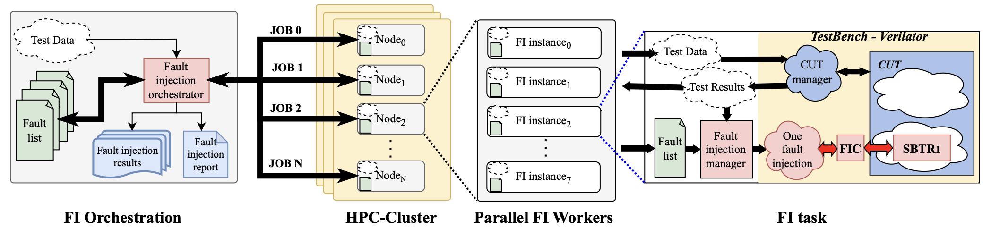
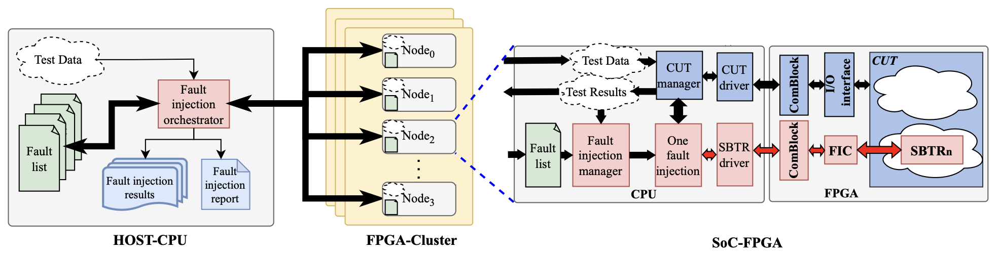

ShadowFI
========

.. image:: https://zenodo.org/badge/1019530660.svg
  :target: https://doi.org/10.5281/zenodo.16730275

ShadowFI is an emulation-based fault injection framework for fault chareacterization and reliability assesemnt of hardware designs.  ShadowFI leverages the acceleration capabilities of hiperscale infrastructures providing support for executing long fault injection tasks in both High Performance Computing (HPC) and FPGA hiperscaler systems.

ShadowFI implments fault instrumentation by inserting saboteur circuits directly on syntesizable HDL designs. This instrumentation is applied automatically based on user configurations, providing flexibility regarding the target components or hardware structures subject of evaluation.

+-------------------------------------------------+--------------------------------------------+-------------------------------------------+
| Fault Instrumentation                           | Fault Simulation Workflow                  | Fault Emulation Workflow                  |
+=================================================+============================================+===========================================+
| .. image:: ./doc/Fault_instrumentation_flow.png | .. image:: ./doc/Fault_simulation_flow.png | .. image:: ./doc/Fault_emulation_flow.png |
|    :width: 300px                                |    :width: 200px                           |    :width: 250px                          |
+-------------------------------------------------+--------------------------------------------+-------------------------------------------+

ShadowFI provides both a CLI and GUI interfaces to automate the configuration and setup of the fault injection campaigns. ShadowFI incorporates two main workflows. The simulation workflow is mainly dedicated for executing fault injection workloads on HPC systems, whereas the emulation workflow accelerates the fault injection taks by using FPGA hiperscale systems.  

.. note:: Simulation Workflow for deployment on HPC systems. 

.. note:: FPGA emulation Workflow for deployment on HyperFPGA system.

Host System Requirements
------------------------

- linux X64 ubuntu 20.04 or superior
- 16 GB RAM or superior
- gcc >= 10
- g++ >= 10
- Clang
- llvm
- ninja-build
- Singularity >= 3.10.5
- OSS CAD Suite >= 20241117 or superior
- Anaconda / Miniconda
- Python >=3.11
- Vivado v2022.2 (For HyperFPGA binaries generation)

Getting Started with ShadowFI on a local machine
------------------------------------------------

This guide shows the basic steps for install and use ShadowFI. You can follow any of the following procedures.

Instalation procedure
~~~~~~~~~~~~~~~~~~~~~

Option 1: Use a prebuild singularity container
**********************************************

1. Install singularity on your machine or ensure that singularity is already installed in your system. Follow the indications presented in this link <https://docs.sylabs.io/guides/3.5/user-guide/quick_start.html.>

2. Clone the ShadowFI repository

    .. code-block:: bash

        git clone https://github.com/divadnauj-GB/shadowfi.git
        cd shadowfi
    

3. Download the prebuild singuarity image with all dependencies

    .. code-block:: bash

        singularity pull  --arch amd64 library://divadnauj-gb/shadowfi/shadowfi:v1
    

4. Run ShadowFI in CLI mode

    .. code-block:: bash

        singularity run shadowfi_v1.sif
        # the following prompt will appear 
    

    .. code-block:: bash
        
        "Welcome to the SHADOWFI Tool shell. Type help or ? to list commands."
        Shadowfi>
    

Option 2: Custom instalation
****************************

1. Clone the ShadowFI repository

    .. code-block:: bash

        git clone https://github.com/divadnauj-GB/shadowfi.git
        cd shadowfi
    

2. Download and install OSS CAD Suite, for a customize intalation you can also the guidelines introduced in <https://github.com/YosysHQ/oss-cad-suite-build>

    .. code-block:: bash

        cd sif
        wget https://github.com/YosysHQ/oss-cad-suite-build/releases/download/2024-11-17/oss-cad-suite-linux-x64-20241117.tgz
        # uncompress into the current directory
        tar -xvzf oss-cad-suite-linux-x64-20241117.tgz
        # Add environmental variables to .bashrc
        PWD=`pwd`
        echo "export PATH=\$PATH:${PWD}/oss-cad-suite/bin" >> ~/.bashrc
        source ~/.bashrc
        cd -
    

3. Create a conda environmet with all the necesary packages

    .. code-block:: bash

        conda create -n SHADOWFI python=3.11
        conda activate SHADOWFI
        pip install -r requirements 
    

4. Run ShadowFI in CLI mode

    .. code-block:: bash

        conda activate SHADOWFI
        python shadowfi_shell.py 
        # the following prompt will appear
        "Welcome to the SHADOWFI Tool shell. Type help or ? to list commands."
        Shadowfi> 
    

Option3: Build your own singularity container
*********************************************

1. Clone the ShadowFI repository

    .. code-block:: bash

        git clone https://github.com/divadnauj-GB/shadowfi.git
        cd shadowfi
    

2. Build the singularity image:
For a different OSS CAD Suite version please modify the oss-cad-link and version on the [shadowfi.def]() file

    .. code-block:: bash

        # This automatically download and integrate OSS CAD on the image
        sudo singularity build shadowfi.sif ./sif/shadowfi.def
    

3. Run ShadowFI in CLI mode

    .. code-block:: bash

        singularty run shadowfi.sif
        # the following prompt will appear
    

    .. code-block:: bash

        "Welcome to the SHADOWFI Tool shell. Type help or ? to list commands."
        Shadowfi> 
    

Executing the first Fault Injection Campaign
~~~~~~~~~~~~~~~~~~~~~~~~~~~~~~~~~~~~~~~~~~~~

The following sequence of steps illustate the interactive use of SHADOFI across a sequence of steps.

1. Run the CLI interface by typing the following command:

    - For singularity enabled systems

        .. code-block:: bash

            singularity run shadowfi_v1.sif
        

    - For local instalation NO singularity

        .. code-block:: bash

            # When not using singularity run the following commands
            conda activate SHADOWFI
            python shadowfi_shell.py
        

2. Create a new project:

    .. code-block:: bash

        Shadowfi> create --name TCU --design-config ./config/TCU/design_config.yml
        [2025-07-25 03:51:38] INFO - Config copied to /home/test_env/shadowfi/projects/TCU/config.yaml
        Configuration saved to /home/test_env/shadowfi/projects/TCU/config.yaml
        [2025-07-25 03:51:38] INFO - Project TCU created at /home/test_env/shadowfi/projects/TCU
        Shadowfi>
    

    After executing this command the project ``TCU`` is created under the ``projects`` directory. The following corresponds to the project directory structure:

    .. code-block:: bash

        ./projects/
        └── TCU/
            ├── config.yaml # The project information
            ├── logs/ #directory with final fault simulation results
            ├── sbtr/ #modified CUT files
            ├── src/ #temporary source files
            └── work/ # work directory
    

3. Elaborate the project:

    .. code-block:: bash

        Shadowfi> elaborate
        ...
        Warnings: 1 unique messages, 1 total
        End of script. Logfile hash: 9633524f2a, CPU: user 0.08s system 0.02s, MEM: 17.46 MB peak
        Yosys 0.47+61 (git sha1 81011ad92, clang++ 18.1.8 -fPIC -O3)
        Time spent: 48% 2x read_verilog (0 sec), 16% 2x write_json (0 sec), ...
        Hierarchy saved to hierarchy.json
        [2025-07-25 03:53:06] INFO - Elaboration completed.
        Shadowfi>
    

4. Configure the fault instrumentation and run saboteur placing and routing:

    .. code-block:: bash

        Shadowfi> pnr --cmp-sel hierarchy --user-cmp-sel ./config/TCU/target_modules_3k.yml
        ...
        Hierarchy saved to hierarchy.json
        [2025-07-25 03:54:35] INFO - Number of target components: 1, Total bit shift: 1534
        Configuration saved to /home/test_env/shadowfi/projects/TCU/config.yaml
        [2025-07-25 03:54:35] INFO - Place and Route completed.
        Shadowfi>
    

5. Configure and compile the testbench simulation:

    .. code-block:: bash

        Shadowfi> tb_setup --tb-config ./config/TCU/tb_config.yml
        ...
        make[1]: Leaving directory '/home/test_env/shadowfi/benchmarks/Cores/TCU/TCU_2/tb/obj_dir'
        - V e r i l a t i o n   R e p o r t: Verilator 5.031 devel rev v5.030-78-g5470cf9fa
        - Verilator: Built from 1.654 MB sources in 25 modules, into 17.552 MB in 25 C++ files needing 0.018 MB
        - Verilator: Walltime 38.198 s (elab=0.288, cvt=4.225, bld=33.160); cpu 5.488 s on 8 threads; alloced 196.203 MB
        -- DONE -------------------------------------
        [2025-07-25 03:56:47] INFO - Simulation setup for project TCU completed successfully.
        Shadowfi> 
    

6. Configure the fault simulation:

    .. code-block:: bash

        Shadowfi> fsim_setup --fsim-config ./config/TCU/sim_config.yml --run-script ./config/TCU/run.sh --sdc-check-script ./config/TCU/sdc_check.sh
        ...
        [2025-07-25 03:58:07] INFO - Setting up fault injection for project: TCU
        Configuration saved to /home/test_env/shadowfi/projects/TCU/config.yaml
        [2025-07-25 03:58:08] INFO - Fault injection setup for project TCU completed successfully.
        Shadowfi> 
    

7. Run the fault injection campaign:

    .. code-block:: bash

        Shadowfi> fsim_exec
        ...
        [2025-07-25 03:32:40] INFO - Running command:  bash /home/test_env/shadowfi/projects/TCU/.parsims/.job0/run.sh 
        [2025-07-25 03:32:42] INFO - Running command:  bash /home/test_env/shadowfi/projects/TCU/.parsims/.job0/sdc_check.sh 
        0,d_unit0@adder0,fpadd_3_pipe,0,1534,5,0,0,Masked

        SDC: 0, Masked: 11
        Fault simulation finished
        [2025-07-25 03:32:42] INFO - Simulation execution complete.
        Shadowfi> 
    

    .. note:: ShadowFI supports a basic scripting support, therefore the previous steps can be executed automatically by executing the following command:

    - For singularity enabled systems

        .. code-block:: bash

            singularity run shadowfi_v1.sif -s TCU.s
        

    - For local instalation NO singularity

        .. code-block:: bash

            # When not using singularity run the following commands
            conda activate SHADOWFI
            python shadowfi_shell.py -s TCU.s
        

Getting Started with HPC simulations
------------------------------------

1. Clone the ShadowFI repository

    .. code-block:: bash

        git clone https://github.com/divadnauj-GB/shadowfi.git
        cd shadowfi
    

2. Download the prebuild singuarity image with all dependencies

    .. code-block:: bash

        singularity pull  --arch amd64 library://divadnauj-gb/shadowfi/shadowfi:v1
    

3. Allocate the necesary computational resources on the HPC by creating and SLURM JOB. For this step it is crucial to configure the [run_world.sh]() script.

    - Open the [run_world.sh]() script and edit the SLURM config accordingly, here some guidelines.

        .. code-block:: bash

            #!/bin/bash -l
            #SBATCH --job-name=ipcluster # set ay name to the job
            #SBATCH --nodes=16  #assign a given number of Nodes
            #SBATCH --ntasks-per-node=8 # select the number of tasks per node
            #SBATCH --cpus-per-task=1 # select the number of CPUs per task
            #SBATCH --mail-user=user@email.com # set an email 
            #SBATCH --mail-type=ALL 
            #SBATCH --time=04:00:00 # set a maximum JOB duration
            #SBATCH --qos= # set the qos according to the HPC system setting
            #SBATCH --partition= # set the partitions according to the HPC system setting
            #SBATCH --account= # set the account if required 
            #SBATCH --output=ipcluster-log-%J.out
            #SBATCH --error=ipcluster-err-%J.out
        

    - Submit the job allocation on the HPC system

        .. code-block:: bash

            sbatch run_world.sh -hpc
        

    - Wait until the HPC start executing the job, for that you can check the job status by executing the following command:

        .. code-block:: bash

            squeue -u $USER

            JOBID    PARTITION     NAME     USER     ST    TIME     NODES NODELIST(REASON)
            18041943 boost_usr   ipcluste  jguerre1  R    1:28:00     16  lrdn[...] 
        

4. You can run an extensive fault simulation by editing any of the Shadowfi scripts, setting the number of parallel tast to be executed according to the parallel world size. The following configuration split the fault injection into 128 tasks and enable the execution on the HPC cluster.

    .. code-block:: bash

        #TCU.s
        create --name TCU --design-config ./config/TCU/design_config.yml
        load --project-dir ./projects/TCU
        elaborate
        pnr --cmp-sel hierarchy --user-cmp-sel ./config/TCU/target_modules_3k.yml
        tb_setup --tb-config ./config/TCU/tb_config.yml
        fsim_setup --fsim-config ./config/TCU/sim_config.yml --run-script ./config/TCU/run.sh --sdc-check-script ./config/TCU/sdc_check.sh
        fsim_setup --noset-run-scripts --kwargs sim_config.tasks=128 sim_config.max_num_faults=-1
        fsim_exec --hpc
    

5. Open `tmux` or `screen` and run ShadowFI in an interactive SLURM JOB either using the CLI or executing an script as follows.

    .. code-block:: bash

        srun -N 1 -n 1 -c 10 --account=<your-account> --partition=<target-partition> --time=<hh:mm:ss>  singularity run shadowfi_v1.sif -s TCU.s
    

    You will see something like:

    .. code-block:: bash

        srun: job <SLURM_JOB_ID> queued and waiting for resources
        ...
        Executing: fsim_setup --noset-run-scripts --kwargs sim_config.tasks=20 sim_config.engines=20 sim_config.max_num_faults=10
        Parsed kwargs: {'tasks': 20, 'engines': 20, 'max_num_faults': 10}
        Configuration saved to /leonardo/home/userexternal/jguerre1/shadowfi/projects/TCU/config.yaml
        Executing: fsim_exec --hpc
        run_one_task_fault_simulation: 100%|██████████| 128/128 [00:15<00:00,  1.29tasks/s] 
        run_one_task_fault_simulat[2025-07-27 02:21:32] INFO - Simulation execution complete.
        Fault simulation finished
    

6. Release the resources from the HPC

    .. code-block:: bash

        scancel -u $USER #This will cancell all jobs from the current user
    

Getting Started with FPGA emulations
------------------------------------

Shadowfi has initial support for the HyperFPGA system, more information about the HyperFPGA can be `found here <https://indico.cern.ch/event/1253805/contributions/5556273/attachments/2726155/4741772/HyperFPGA_CERN_SoC.pptx.>`_. We are working to extend ShadowFI to other FPGAs as A Service (FAAS) systems such as AWS EC2, cloudFPGA among others.

The following steps will guide you on how to execute fault emulation of several benchmarks included by ShadowFI.

1. Login into the HyperFPGA platform:

    .. image:: ./doc/HyperFPGA-Sign-In.png
        :width: 400
        :align: center

2. Open a shell and clone the ShSHADOWFI repository

    .. code-block:: bash

        git clone https://github.com/divadnauj-GB/shadowfi.git
        cd shadowfi
    

3. Download and install OSS CAD Suite, for a customize intalation you can also the guidelines introduced in <https://github.com/YosysHQ/oss-cad-suite-build>

    .. code-block:: bash

        cd sif
        wget https://github.com/YosysHQ/oss-cad-suite-build/releases/download/2024-11-17/oss-cad-suite-linux-x64-20241117.tgz
        # uncompress into the current directory
        tar -xvzf oss-cad-suite-linux-x64-20241117.tgz
        # Add environmental variables to .bashrc
        PWD=`pwd`
        echo "export PATH=\$PATH:${PWD}/oss-cad-suite/bin" >> ~/.bashrc
        source ~/.bashrc
        cd -
    

4. Activate the conda environmet in HyperFPGA:

    .. code-block:: bash

        conda activate python311
    

5. Run ShadowFI in CLI mode

    .. code-block:: bash

        python shadowfi_shell.py 
        # the following prompt will appear
        "Welcome to the SHADOWFI Tool shell. Type help or ? to list commands."
        Shadowfi> 
    

Until here you have succesfully prepare ShadowFI for HyperFPGA integration. You can use interactiveley Shadowfi for inserting saboteurs on the target CUT. Let's walk the the procedure for running a complete fault emulation on FPGA devices for the TCU benchmark.

1. Execute the following commands either using the CLI interface or the scripting support in Shadowfi.

    .. code-block:: bash

        Shadowfi> create --name TCU --design-config ./config/TCU/design_config.yml
        Shadowfi> load --project-dir ./projects/TCU
        Shadowfi> elaborate
        Shadowfi> pnr --cmp-sel hierarchy --user-cmp-sel ./config/TCU/target_modules_3k.yml
        Shadowfi> fi_fpga_setup --emu-config ./config/TCU/emu_config.yml  
        Shadowfi> fi_fpga_exec
    

    These commands will create, configure, compile and execute fault emulation flow automatically for the TCU benchmark. After executing the previous commands you will get promt messages on the terminal, the following indicates whether the process was successful or not. It is worth noting that executing the `fi_fpga_setup` will issue a vivado compilation process which may require approximately ~30 minutes, but this time my be longer or shorter depending on the evalauted benchmark.

    .. code-block:: bash

        run_one_task_fault_free_emulation: 100%|█████████████████████████████████████████| 1/1 [00:00<00:00,  4.89tasks/s]
        [2025-07-30 12:03:33] INFO - <AsyncMapResult(run_one_task_fault_free_emulation): finished>
        [2025-07-30 12:03:34] INFO - Starting 1 engines with <class 'ipyparallel.cluster.launcher.SSHEngineSetLauncher'>
        [2025-07-30 12:03:37] INFO - ensuring remote mlabadm@192.168.0.16:.ipython/profile_ssh/security/ exists
        [2025-07-30 12:03:38] INFO - sending /home/jupyter-torino-user/.ipython/profile_ssh/security/ipcontroller-1753869813-kwr1-client.json to mlabadm@192.168.0.16:.ipython/profile_ssh/security/ipcontroller-1753869813-kwr1-client.json
        [2025-07-30 12:03:38] INFO - ensuring remote mlabadm@192.168.0.16:.ipython/profile_ssh/security/ exists
        [2025-07-30 12:03:38] INFO - sending /home/jupyter-torino-user/.ipython/profile_ssh/security/ipcontroller-1753869813-kwr1-engine.json to mlabadm@192.168.0.16:.ipython/profile_ssh/security/ipcontroller-1753869813-kwr1-engine.json
        [2025-07-30 12:03:39] INFO - Running `python3 -m ipyparallel.engine --profile-dir=/home/mlabadm/.ipython/profile_ssh`
        importing os on engine(s)
        importing unpack from struct on engine(s)
        importing Comblock from comblock on engine(s)
        run_one_task_fault_emulation: 100%|███████████████████████████████████████████████| 2/2 [00:00<00:00,  3.05tasks/s]
        [2025-07-30 12:03:50] INFO - <AsyncMapResult(run_one_task_fault_emulation): finished>
        [2025-07-30 12:03:50] INFO - Stopping engine(s): 1753869814
        [2025-07-30 12:03:54] INFO - fetching /tmp/tmpd_w2holx/ipengine-1753869819.3422.out from mlabadm@192.168.0.16:.ipython/profile_ssh/log/ipengine-1753869819.3422.out
        [2025-07-30 12:03:55] INFO - Removing mlabadm@192.168.0.16:.ipython/profile_ssh/log/ipengine-1753869819.3422.out
        [2025-07-30 12:03:55] INFO - Stopping controller
        [2025-07-30 12:03:55] INFO -  FPGA execution complete.
    

    Equivalent procedure can be follow for the other available benchmarks. Please refer to the documentation to properly configure the flow to any other design or application under test.
